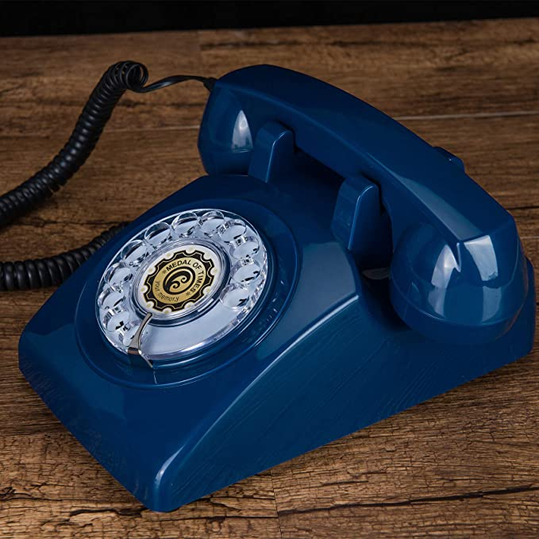
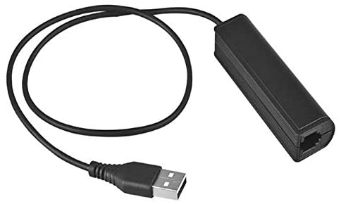

# PhoneHome
Project to create a rotary phone that records messages for my sister's wedding. 
## Hardware
There are a handful of things I bought to make this work.
1. Raspberry Pi
  * I used a Raspberry Pi Zero 1.3 that I had lying around
2. A rotary phone
  * I got [this one](https://www.amazon.com/dp/B08L7L7PZX/ref=cm_sw_r_apan_i_Q2940B3F6AFTXYAPHZ29?_encoding=UTF8&th=1) from Amazon:

  * It doesn't have to be this phone or even a rotary phone. With a different one, the rotary dial or keypad interface will vary
3. RJ9 to USB Adapter
  * I got [this one](https://www.amazon.com/gp/product/B08BTKJJFV/ref=ppx_yo_dt_b_asin_title_o06_s00?ie=UTF8&psc=1):

  * You need something to take the RJ9 connector from the handset and do all of A/D and D/A conversions. I figured this was the easiest way. You could also use the analog functionality of the Raspberry Pi, but I've heard that isn't great because it uses the PWM function of the Pi and smooths it out to generate analog signals. Dedicated hardware might be better. 

More updates to come!
